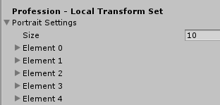
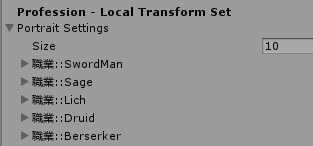

# UnityNamedArray

Let SerializeField can display more useful information which is ICollection

為了有時候跨職能(ex.企劃/程式)的欄位設計能更有效的溝通， 
針對序列化的資料集合欄位做一個非常簡易的顯示優化 

# How To Use
#### 1. Let your field can display on Inspector Window.
##### 先讓你的欄位能顯示在Unity的Inspector視窗中

#### 2. Find target collection which you want to modify.
##### 找到你想要修改的欄位，理論上他應該是一維陣列或是繼承了ICollection的集合類別

#### 3. Choose a display type which you wanted.
##### 選一種你想要的顯示方法
A. Display by typical string / 顯示自定義前綴字

    [NameArray("Your Typical Prefix")]
    
B. Display by Customized format / 顯示格式化

    [NameArray("Your Customized {0} format ", true)]

C. Display by Enum / 顯示列舉

    [NameArray(typeof(YourEnum)]
    
D. Both all
    
    [NameArray(typeof(YourEnum),"Your Typical Prefix")]
    
#### 4. It's done.

# Another
#### 其他一些實作上遇到的問題及情境

#### 1. Field information is doesn't want to mapping Enum start from first value
##### 顯示所對應的列舉不希望從第一個代表值開始

    [NameArray(typeof(YourEnum), "Your Typical Prefix", startOffestIndex)]
